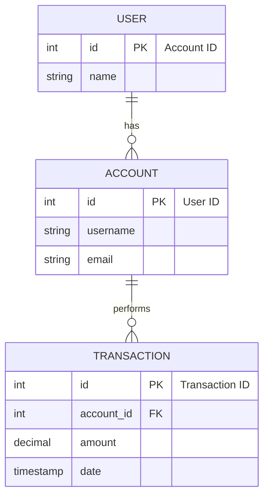

## RACIO Accounts ER Diagrams

根据您提供的文本内容，以下是按照文本描述执行的步骤，以创建Mermaid格式的ER图代码：

1. **解析实体**：从DDL中识别出以下实体（表）：
   - public.apps
   - public.app_model_configs
   - public.app_dataset_joins
   - public.app_annotation_settings
   - public.app_annotation_hit_histories
   - public.tenants
   - public.tenant_preferred_model_providers
   - public.tenant_default_models
   - public.tenant_account_joins
   - public.accounts
   - public.account_integrates
   - public.conversations

2. **识别属性**：每个表的列定义为实体的属性。

3. **确定主键**：每个表的PRIMARY KEY定义为实体的主键。

4. **识别外键**：表中的外键列定义了实体之间的关系。

5. **定义关系**：根据外键列，定义实体间的一对多或一对一关系。

6. **使用Mermaid语法**：使用`erDiagram`来创建ER图。

7. **实体和属性表示**：使用`entityName { attribute1, attribute2, ... }`格式。

8. **关系表示**：使用`entityA ||--o{ entityB : "relationship"`来表示关系。

9. **主键和外键**：使用`PK`和`FK`来表示。

10. **索引和约束**：使用注释表示。

11. **生成Mermaid代码**：将上述信息转换为Mermaid代码。

以下是根据上述步骤生成的部分Mermaid ER图代码示例：

```mermaid
---
title: DIFY DB ER DIAGRRAM
--- 
erDiagram
    APPS ||--o{ APP_MODEL_CONFIGS : "has_configs"
    APPS ||--o{ APP_DATASET_JOINS : "includes"
    APPS ||--o{ APP_ANNOTATION_SETTINGS : "has_settings"
    APPS ||--o{ APP_ANNOTATION_HIT_HISTORIES : "generates"
    APPS ||--o{ CONVERSATIONS : "has"

    TENANTS ||--o{ APPS : "owns"
    TENANTS ||--o{ TENANT_PREFERRED_MODEL_PROVIDERS : "prefers"
    TENANTS ||--o{ TENANT_DEFAULT_MODELS : "uses"
    TENANTS ||--|{ TENANT_ACCOUNT_JOINS : "related_to"

    ACCOUNTS ||--o{ APP_ANNOTATION_HIT_HISTORIES : "generates"
    ACCOUNTS ||--|{ ACCOUNT_INTEGRATES : "has"
    ACCOUNTS ||--|{ TENANT_ACCOUNT_JOINS : "participates"

    APPS {
        uuid id PK "App ID"
        uuid tenant_id FK "Tenant ID"
        string name "Name" 
        string mode "Mode" 
        varchar icon "Icon"
        varchar icon_background "Icon Background"
        uuid app_model_config_id FK "App Model Config ID" 
        string status "Status" 
        bool enable_site "Enable Site" 
        bool enable_api "Enable API" 
        int api_rpm "API RPM" 
        int api_rph "API Rph" 
        bool is_demo "Is Demo" 
        bool is_public "Is Public" 
        bool is_universal "Is Universal" 
        uuid workflow_id "Workflow ID" 
        timestamp created_at "Created At" 
        timestamp updated_at "Updated At"
        text description "Description"
    }

    APP_MODEL_CONFIGS {
        uuid id PK "Config ID" 
        uuid app_id FK "App ID" 
        varchar provider "Provider" 
        varchar model_id "Model ID" 
        json configs "Configs"
        timestamp created_at "Created At" 
        timestamp updated_at "Updated At"
        text opening_statement "Opening Statement"
        text suggested_questions "Suggested Questions"
        text suggested_questions_after_answer "Suggested Questions After Answer"
        text more_like_this "More Like This"
        text model "Model"
        text user_input_form "User Input Form"
        text pre_prompt "Pre Prompt"
        text agent_mode "Agent Mode"
        text speech_to_text "Speech To Text"
        text sensitive_word_avoidance "Sensitive Word Avoidance"
        text retriever_resource "Retriever Resource"
        varchar dataset_query_variable "Dataset Query Variable"
        varchar prompt_type "Prompt Type" 
        text chat_prompt_config "Chat Prompt Config"
        text completion_prompt_config "Completion Prompt Config"
        text dataset_configs "Dataset Configs"
        text external_data_tools "External Data Tools"
        text file_upload "File Upload"
        text text_to_speech "Text To Speech"
    }
    APP_DATASET_JOINS {
        uuid id PK "Join ID"
        uuid app_id FK "App ID"
        uuid dataset_id FK "Dataset ID"
        timestamp created_at "Created At"
    }

    APP_ANNOTATION_SETTINGS {
        uuid id PK "Settings ID"
        uuid app_id FK "App ID"
        float8 score_threshold "Score Threshold"
        uuid collection_binding_id FK "Collection Binding ID"
        uuid created_user_id FK "Created By ID"
        timestamp created_at "Created At"
        uuid updated_user_id FK "Updated By ID"
        timestamp updated_at "Updated At"
    }

    APP_ANNOTATION_HIT_HISTORIES {
        uuid id PK "History ID"
        uuid app_id FK "App ID"
        uuid annotation_id FK "Annotation ID"
        text source "Source"
        text question "Question"
        uuid account_id FK "Account ID"
        timestamp created_at "Created At"
        float8 score "Score"
        uuid message_id FK "Message ID"
        text annotation_question "Annotation Question"
        text annotation_content "Annotation Content"
    }

    TENANTS {
        uuid id PK "Tenant ID"
        string name "Name"
        text encrypt_public_key "Encrypt Public Key"
        string plan "Plan"
        string status "Status"
        timestamp created_at "Created At"
        timestamp updated_at "Updated At"
        text custom_config "Custom Config"
    }

    TENANT_PREFERRED_MODEL_PROVIDERS {
        uuid id PK "Provider ID"
        uuid tenant_id FK "Tenant ID"
        string provider_name "Provider Name"
        string preferred_provider_type "Preferred Provider Type"
        timestamp created_at "Created At"
        timestamp updated_at "Updated At"
    }

    TENANT_DEFAULT_MODELS {
        uuid id PK "Default Model ID"
        uuid tenant_id FK "Tenant ID"
        string provider_name "Provider Name"
        string model_name "Model Name"
        string model_type "Model Type"
        timestamp created_at "Created At"
        timestamp updated_at "Updated At"
    }

    TENANT_ACCOUNT_JOINS {
        uuid id PK "Join ID"
        uuid tenant_id FK "Tenant ID"
        uuid account_id FK "Account ID"
        string role "Role"
        uuid invited_by FK "Invited By ID"
        bool current "Is Current"
        timestamp created_at "Created At"
        timestamp updated_at "Updated At"
    }

    ACCOUNTS {
        uuid id PK "Account ID"
        string name "Name"
        string email "Email"
        string password "Password"
        string password_salt "Password Salt"
        string avatar "Avatar"
        string interface_language "Interface Language"
        string interface_theme "Interface Theme"
        string timezone "Timezone"
        timestamp last_login_at "Last Login At"
        string last_login_ip "Last Login IP"
        string status "Status"
        timestamp initialized_at "Initialized At"
        timestamp created_at "Created At"
        timestamp updated_at "Updated At"
        timestamp last_active_at "Last Active At"
    }

    ACCOUNT_INTEGRATES {
        uuid id PK "Integrate ID"
        uuid account_id FK "Account ID"
        string provider "Provider"
        string open_id "Open ID"
        string encrypted_token "Encrypted Token"
        timestamp created_at "Created At"
        timestamp updated_at "Updated At"
    }

    CONVERSATIONS {
        uuid id PK "Conversation ID"
        uuid app_id FK "App ID"
        uuid app_model_config_id FK "App Model Config ID"
        string model_provider "Model Provider"
        text override_model_configs "Override Model Configs"
        string model_id "Model ID"
        string mode "Mode"
        string name "Name"
        text summary "Summary"
        json inputs "Inputs"
        text introduction "Introduction"
        text system_instruction "System Instruction"
        int system_instruction_tokens "System Instruction Tokens"
        string status "Status"
        string from_source "From Source"
        uuid from_end_user_id FK "From End User ID"
        uuid from_account_id FK "From Account ID"
        timestamp read_at "Read At"
        uuid read_account_id FK "Read Account ID"
        timestamp created_at "Created At"
        timestamp updated_at "Updated At"
        bool is_deleted "Is Deleted"
        string invoke_from "Invoke From"
    }
```

[![](https://mermaid.ink/img/pako:eNrFWVlz2zgM_iscPzfvO3lTfLRqE9trK93ZGc9wGJm2uZEoLUWl6x7_fQGSknVQTpxsu5kkJsAPPAAQAOlvozjb8tH16OrqaiO10Am_JpNw9ieZ3JDpCprB-9UquNtIAJCN5Goi2F6xdCMJ_ATL5Zp8_351lX3DNr1bTKa3dLyYz8L3a3JNNqMDK2icyZ3YF5uRX2gSRMF6GtGPi3BuhYSMk3LLByWC-XwRBVG4mFMQjMJ5Y7KCay3k_iWyH8II_tbRYhVO7QB7Djtk2j8zbOvzdLU2svV8CLTQaDoP5lFzLgvKvsh6uA7GknS5ms6mq9V04vS3XC0-hxOYysjniu-4emaIyXQW3N9GdgArVxbcK_S9FgrG48X9vKl4xRPY_Zbq7LQvh3qLEpsjwPTVvOE8mr5fBdG0pU2fxOCCc6a0iEVeTdew2jfbxp-yFFsCv8tPIBLkOQkn1Ux1t-aSSU2hNUNUZMgOsNAKXItIlnKAzOFjMyK97hROFHTfwUer-4mp-MAUEXAeoD-Ej-bgzW76wOLHvcpKuXVIclNzektneU5x0sSdtHoTuFVcRkLGpsNsp7_gQjNdFoBfm0YL8pBlCQFdPCScFkLjxqaGImugBqEsFydksAxbQAGKBQBVeYqLXIZktbwbQBwqRH7oTyYKuuVphioqyARaXkhePiQitqClaXthpRRPcM5YYpH3FdkCG31_ydTjLsm-oJ43oz8c1VWuFikHzaY5iRU3p4ppgI8tQQI9gC7z7Ql9bwmDboD5P5pAfIyVyLUw3jQ5URXyR-M4dCLz0Nnwu0ntZE2_6mAq781V9iS2XAFq6ZpenPVXo0DroZ3x_ipgWy5x1AsrWkr4yfrNci7hdFA8HTzlEuELyyPriteTKsr9HiaC8f8u4RPMYQ5WxSW_V9yXSFK201xRJosvRqOeYUiAEBIYSG_MNFOcJuKRU30QhdG14uQWGCQChgePpnAm6fVCRlFUyLzUdJcpPLv3wCEhcsgMOD0JyF0UPCLNtfEHTpaG6OEY5AxNXeAMkCA2fHZ1lHMeHyA9UUOCRgyDRBmJgNHHcwlBCw4yhTMLJn_KxJbJGGdZV10EDjA4QNXVG0NxiJIcYgFVvMhKZaRXFZOsHNMXysG3GNQjaFB1pMAVJh7CabUdaEZ1JJ9dh28Iqz2qjzm3Rwp1GQHV9m5cKOC107ZLBHgcgOm07pJAb4MxdCYcvakvXXc9M0a109OJrbboO7koAX9cSZZQFAWLZglKTR2XoDiYFbg9yZ2ABFPmScYwesyAIveG6iHxHzqLdRuT1YELzmLdphEoqzDZrkWHwuTHTEhfDeGLkR1IpagKVqmpDX1BbPPEeF9ZPLSFtSuTL98G5DqmfyNFjLFFH-BQHLIELbFGDsQVx-kNG2dJwmPjZw9CbjG2VrOM6y5yY7t866p0YeNQJep0cnN8rQ7r8avM0Bq_yhBnxn8mowzZqF05Dxnqgyh0po6vdDcmZQa5CnVeI2tWd0MmYlYRbt2Laqa_yk2AqHJQf9I4hjr15OOBpd9in6bTVa7WmxfGKyCT1PPeWdq3zYZeGjtqqMa3ua4kBDtt64KG4Ngye8avrmBDdn7xhaMbR2WsjhCzbZVLH_nRFN6G6cpd8okfPaPmCcNNL-HD09u7FLzScpcXXnEJHp82kpChO5mno9czd-ghhVfl6Rsvg1XBS52R6mG71qrxeJ1XoIdask7urofUY9hE_7M139Vl5zFhSIETvmNlosmpfv91WrTXBwe2CziLdCq2yP9Hq-3Hi0tLi5fo8oLg65SjMlOOrrKkH02FfBK4vYejHSi0dD8Rmgt0XILnmlgId-exJX6hjusHo8FXn3NqGIivrpenTOClaIqfPt9lRYHXC3Rb1zyDogVLdANK1kB78OwJKkO89AWm4UEISDRqx2K44TG5LzHToZUck9w65llJfeBpWyxCjkcGbfI1kwiOXNNvsoQVmibZXkhrtVugyS3SHSu7gRt4kbfx4fK1iUlIuNuxRHytfCc8MQad7T_PZm2dsNjcRE9KCQzjjDs3X0iHHBstt8fn1jcHA-_TTQ-FzyL23QYfQ_wjuZrEPCQ_cnkqSEBFEXJ-YWRov9qfefgyr32esvjFpfZFr7ADeaphAyvis4R9noL1KuhpzYnHYuE6WnMWgzN2nuDOv2ZfVJkWZZoydTTvVqbVRJj3PfOWVBgnxkZvBIhTKtuWsSvPwwbZn-1YaJ5SIWFltcTaMEl4Yjbl8JW5L2Z9tvBKW-8tLotKDrFTUNTW16sZUKR_xzKeZJBcdi6iRmIqt8Q-uk38Yt0Tb6Seu4DBUXMHaQUt39XYIjpjW_DbL3cXBdXTw3_Csde9_RvCm-qewGQUdWNrGKAIKqUOFKN3o5QryO3b0fXIxIfNSNskiN8wbW2Vi3CEslJn66OMR9fgE_zdSGXl_jC63rGkAMqu331FWnP5VsAV_s5-0Wq-b_3xLzDFR1k?type=png)](https://mermaid.live/edit#pako:eNrFWVlz2zgM_iscPzfvO3lTfLRqE9trK93ZGc9wGJm2uZEoLUWl6x7_fQGSknVQTpxsu5kkJsAPPAAQAOlvozjb8tH16OrqaiO10Am_JpNw9ieZ3JDpCprB-9UquNtIAJCN5Goi2F6xdCMJ_ATL5Zp8_351lX3DNr1bTKa3dLyYz8L3a3JNNqMDK2icyZ3YF5uRX2gSRMF6GtGPi3BuhYSMk3LLByWC-XwRBVG4mFMQjMJ5Y7KCay3k_iWyH8II_tbRYhVO7QB7Djtk2j8zbOvzdLU2svV8CLTQaDoP5lFzLgvKvsh6uA7GknS5ms6mq9V04vS3XC0-hxOYysjniu-4emaIyXQW3N9GdgArVxbcK_S9FgrG48X9vKl4xRPY_Zbq7LQvh3qLEpsjwPTVvOE8mr5fBdG0pU2fxOCCc6a0iEVeTdew2jfbxp-yFFsCv8tPIBLkOQkn1Ux1t-aSSU2hNUNUZMgOsNAKXItIlnKAzOFjMyK97hROFHTfwUer-4mp-MAUEXAeoD-Ej-bgzW76wOLHvcpKuXVIclNzektneU5x0sSdtHoTuFVcRkLGpsNsp7_gQjNdFoBfm0YL8pBlCQFdPCScFkLjxqaGImugBqEsFydksAxbQAGKBQBVeYqLXIZktbwbQBwqRH7oTyYKuuVphioqyARaXkhePiQitqClaXthpRRPcM5YYpH3FdkCG31_ydTjLsm-oJ43oz8c1VWuFikHzaY5iRU3p4ppgI8tQQI9gC7z7Ql9bwmDboD5P5pAfIyVyLUw3jQ5URXyR-M4dCLz0Nnwu0ntZE2_6mAq781V9iS2XAFq6ZpenPVXo0DroZ3x_ipgWy5x1AsrWkr4yfrNci7hdFA8HTzlEuELyyPriteTKsr9HiaC8f8u4RPMYQ5WxSW_V9yXSFK201xRJosvRqOeYUiAEBIYSG_MNFOcJuKRU30QhdG14uQWGCQChgePpnAm6fVCRlFUyLzUdJcpPLv3wCEhcsgMOD0JyF0UPCLNtfEHTpaG6OEY5AxNXeAMkCA2fHZ1lHMeHyA9UUOCRgyDRBmJgNHHcwlBCw4yhTMLJn_KxJbJGGdZV10EDjA4QNXVG0NxiJIcYgFVvMhKZaRXFZOsHNMXysG3GNQjaFB1pMAVJh7CabUdaEZ1JJ9dh28Iqz2qjzm3Rwp1GQHV9m5cKOC107ZLBHgcgOm07pJAb4MxdCYcvakvXXc9M0a109OJrbboO7koAX9cSZZQFAWLZglKTR2XoDiYFbg9yZ2ABFPmScYwesyAIveG6iHxHzqLdRuT1YELzmLdphEoqzDZrkWHwuTHTEhfDeGLkR1IpagKVqmpDX1BbPPEeF9ZPLSFtSuTL98G5DqmfyNFjLFFH-BQHLIELbFGDsQVx-kNG2dJwmPjZw9CbjG2VrOM6y5yY7t866p0YeNQJep0cnN8rQ7r8avM0Bq_yhBnxn8mowzZqF05Dxnqgyh0po6vdDcmZQa5CnVeI2tWd0MmYlYRbt2Laqa_yk2AqHJQf9I4hjr15OOBpd9in6bTVa7WmxfGKyCT1PPeWdq3zYZeGjtqqMa3ua4kBDtt64KG4Ngye8avrmBDdn7xhaMbR2WsjhCzbZVLH_nRFN6G6cpd8okfPaPmCcNNL-HD09u7FLzScpcXXnEJHp82kpChO5mno9czd-ghhVfl6Rsvg1XBS52R6mG71qrxeJ1XoIdask7urofUY9hE_7M139Vl5zFhSIETvmNlosmpfv91WrTXBwe2CziLdCq2yP9Hq-3Hi0tLi5fo8oLg65SjMlOOrrKkH02FfBK4vYejHSi0dD8Rmgt0XILnmlgId-exJX6hjusHo8FXn3NqGIivrpenTOClaIqfPt9lRYHXC3Rb1zyDogVLdANK1kB78OwJKkO89AWm4UEISDRqx2K44TG5LzHToZUck9w65llJfeBpWyxCjkcGbfI1kwiOXNNvsoQVmibZXkhrtVugyS3SHSu7gRt4kbfx4fK1iUlIuNuxRHytfCc8MQad7T_PZm2dsNjcRE9KCQzjjDs3X0iHHBstt8fn1jcHA-_TTQ-FzyL23QYfQ_wjuZrEPCQ_cnkqSEBFEXJ-YWRov9qfefgyr32esvjFpfZFr7ADeaphAyvis4R9noL1KuhpzYnHYuE6WnMWgzN2nuDOv2ZfVJkWZZoydTTvVqbVRJj3PfOWVBgnxkZvBIhTKtuWsSvPwwbZn-1YaJ5SIWFltcTaMEl4Yjbl8JW5L2Z9tvBKW-8tLotKDrFTUNTW16sZUKR_xzKeZJBcdi6iRmIqt8Q-uk38Yt0Tb6Seu4DBUXMHaQUt39XYIjpjW_DbL3cXBdXTw3_Csde9_RvCm-qewGQUdWNrGKAIKqUOFKN3o5QryO3b0fXIxIfNSNskiN8wbW2Vi3CEslJn66OMR9fgE_zdSGXl_jC63rGkAMqu331FWnP5VsAV_s5-0Wq-b_3xLzDFR1k)

### Prompt 

将SQL DDL转换为Mermaid描述的ER图需要对DDL进行解析，并识别出实体、属性、主键、外键以及它们之间的关系。以下是一些步骤和提示词，可以帮助你完成这个过程：

1. **解析实体**：
   - 识别DDL中定义的每个表，这些表在ER图中表示为实体。

2. **识别属性**：
   - 列出每个实体的所有列，这些列在ER图中表示为属性。

3. **确定主键**：
   - 找出每个实体的主键，它在ER图中用来唯一标识实体。

4. **识别外键**：
   - 确定哪些列是外键，它们在ER图中表示实体之间的关系。

5. **定义关系**：
   - 根据外键定义实体之间的关系，如一对一、一对多或多对多。

6. **使用Mermaid语法**：
   - 使用Mermaid的`erDiagram`语法来创建ER图。

7. **实体和属性表示**：
   - 使用`entityName { attribute1, attribute2, ... }`格式表示每个实体及其属性。

8. **关系表示**：
   - 使用`entityA ||--o{ entityB : "relationship"`来表示一对多关系，其中`o`表示多的一端，`||`表示一对一关系。

9. **主键和外键**：
   - 使用`PK`和`FK`来表示主键和外键。

10. **索引和约束**：
    - 可以使用注释或附加文本来表示索引和约束。

11. **递归和继承**：
    - 如果存在递归或继承关系，使用相应的Mermaid语法表示。

12. **弱实体集**：
    - 如果存在弱实体集，使用虚线框和连接到强实体集的线表示。

13. **角色扮演**：
    - 如果实体扮演不同角色，使用不同的线和标签来区分。

14. **生成Mermaid代码**：
    - 将上述信息转换为Mermaid代码。

以下是一个简化的示例，展示如何将SQL DDL转换为Mermaid ER图代码：

在这个示例中，`USER`和`ACCOUNT`是一对一关系，`ACCOUNT`和`TRANSACTION`是一对多关系。每个实体的属性和主键/外键都已列出。根据你的DDL，你可以按照这个模式来创建自己的Mermaid ER图代码。