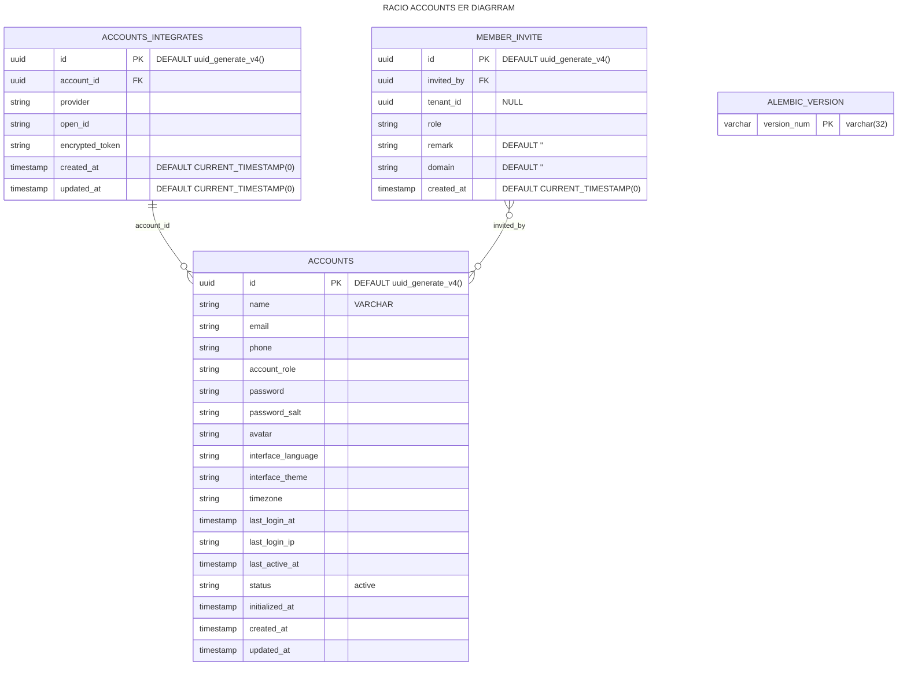
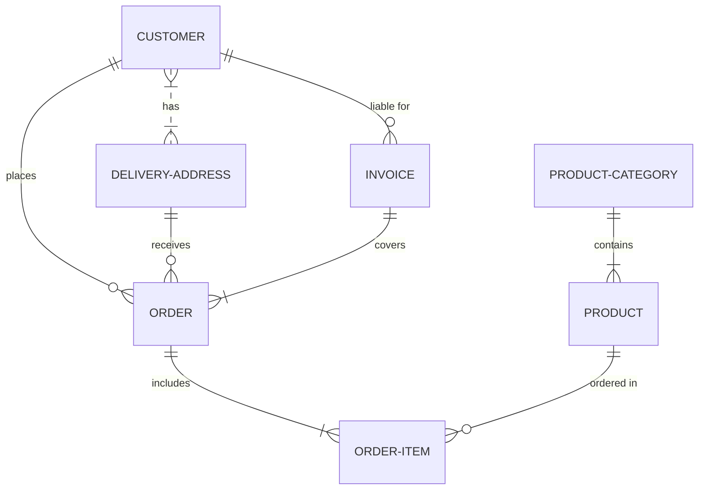

## RACIO Accounts ER Diagrams

### Mermaid Live Editor

[](https://mermaid.live/edit#pako:eNqtVV9vmzAQ_yqWX5pKjTRte8obS2iHGpKKkDwhoRtciFWwkTmY0jbffQaaQgepJnUWL9zvj3znO_uZRypGPuPT6TSQJCjFGfOsubNm1ny-3q78DbM9tnCsO8-z3EAaHgsk6oWAREMWSGbWmRo6K9--8yzf3rCXl-lUPXcuMxZwiCJVSgpFHPBW6druD9szup3j2-ykhhohK0EYh7-OZ80b_Nz-16ssRczM93BvJAv71tou_SYYJmh2C4Rh9X1yfbaoV0FayIRJyNBodpY3_2l5IwTMQKRsEM4PSuIwfE5Rq3QEzaEofisds8tQWEBKIzhUQKCHcSEJ9R4iDFOQSQkJfsShA5p0hwwSGT7VCfWgOlYQZDlLoaAwVYmQIdBQ3INFftkAIhIVGoeBgSFRWTQNUlP6h9B5CClIQCqeTDP0PTpGpBHoIlrm8Tv0dLl3P9dYjaRrdXZ7PzxsrSoR48hxqhxlLRq2oYz0Ma8TIPWI8uP8e3udbz3PXvmh77j2xrfch8mX6_ECdwX6R_lpbIb_Q-26kTe1Y3-BhBLaugZ8tV0uRya2nr1h0Myxfuxt5OpqRBorM-3yIusTtT6329JUy5mHO9vbOOtVv1wV6OhgRrxCXQglQ1lmbelegcm3r50bv-EZarPZ2FzejUnAm-EOeH1rxriHMqWaXlOhJLU5yojPSJd4w7UqkwOf7SEtzF978K83-lsUY0FKu-3z0LwSpz-TQ-Pf)