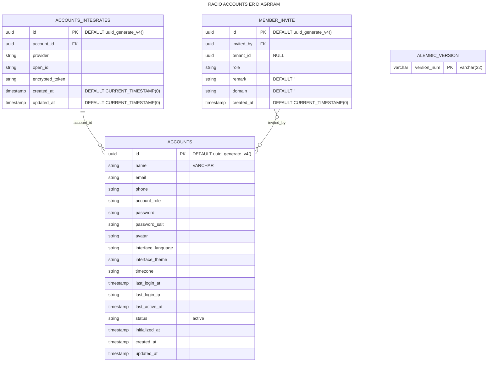
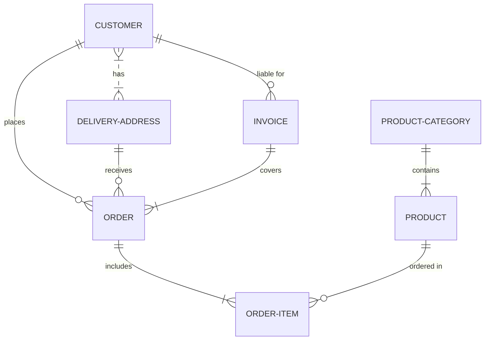
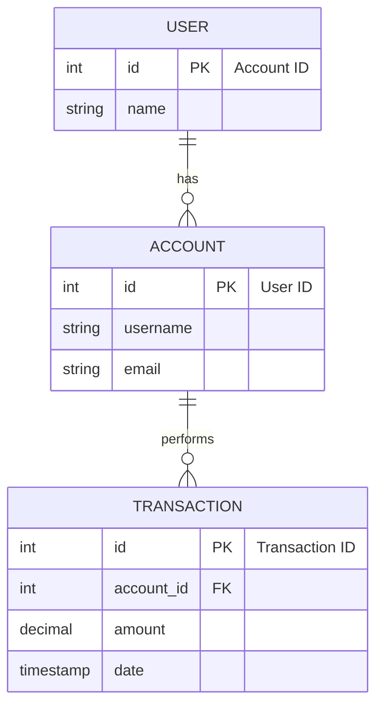

## RACIO Accounts ER Diagrams

### Mermaid Live Editor

[](https://mermaid.live/edit#pako:eNqtVV9vmzAQ_yqWX5pKjTRte8obS2iHGpKKkDwhoRtciFWwkTmY0jbffQaaQgepJnUWL9zvj3znO_uZRypGPuPT6TSQJCjFGfOsubNm1ny-3q78DbM9tnCsO8-z3EAaHgsk6oWAREMWSGbWmRo6K9--8yzf3rCXl-lUPXcuMxZwiCJVSgpFHPBW6druD9szup3j2-ykhhohK0EYh7-OZ80b_Nz-16ssRczM93BvJAv71tou_SYYJmh2C4Rh9X1yfbaoV0FayIRJyNBodpY3_2l5IwTMQKRsEM4PSuIwfE5Rq3QEzaEofisds8tQWEBKIzhUQKCHcSEJ9R4iDFOQSQkJfsShA5p0hwwSGT7VCfWgOlYQZDlLoaAwVYmQIdBQ3INFftkAIhIVGoeBgSFRWTQNUlP6h9B5CClIQCqeTDP0PTpGpBHoIlrm8Tv0dLl3P9dYjaRrdXZ7PzxsrSoR48hxqhxlLRq2oYz0Ma8TIPWI8uP8e3udbz3PXvmh77j2xrfch8mX6_ECdwX6R_lpbIb_Q-26kTe1Y3-BhBLaugZ8tV0uRya2nr1h0Myxfuxt5OpqRBorM-3yIusTtT6329JUy5mHO9vbOOtVv1wV6OhgRrxCXQglQ1lmbelegcm3r50bv-EZarPZ2FzejUnAm-EOeH1rxriHMqWaXlOhJLU5yojPSJd4w7UqkwOf7SEtzF978K83-lsUY0FKu-3z0LwSpz-TQ-Pf)

### Prompt 

将SQL DDL转换为Mermaid描述的ER图需要对DDL进行解析，并识别出实体、属性、主键、外键以及它们之间的关系。以下是一些步骤和提示词，可以帮助你完成这个过程：

1. **解析实体**：
   - 识别DDL中定义的每个表，这些表在ER图中表示为实体。

2. **识别属性**：
   - 列出每个实体的所有列，这些列在ER图中表示为属性。

3. **确定主键**：
   - 找出每个实体的主键，它在ER图中用来唯一标识实体。

4. **识别外键**：
   - 确定哪些列是外键，它们在ER图中表示实体之间的关系。

5. **定义关系**：
   - 根据外键定义实体之间的关系，如一对一、一对多或多对多。

6. **使用Mermaid语法**：
   - 使用Mermaid的`erDiagram`语法来创建ER图。

7. **实体和属性表示**：
   - 使用`entityName { attribute1, attribute2, ... }`格式表示每个实体及其属性。

8. **关系表示**：
   - 使用`entityA ||--o{ entityB : "relationship"`来表示一对多关系，其中`o`表示多的一端，`||`表示一对一关系。

9. **主键和外键**：
   - 使用`PK`和`FK`来表示主键和外键。

10. **索引和约束**：
    - 可以使用注释或附加文本来表示索引和约束。

11. **递归和继承**：
    - 如果存在递归或继承关系，使用相应的Mermaid语法表示。

12. **弱实体集**：
    - 如果存在弱实体集，使用虚线框和连接到强实体集的线表示。

13. **角色扮演**：
    - 如果实体扮演不同角色，使用不同的线和标签来区分。

14. **生成Mermaid代码**：
    - 将上述信息转换为Mermaid代码。

以下是一个简化的示例，展示如何将SQL DDL转换为Mermaid ER图代码：

在这个示例中，`USER`和`ACCOUNT`是一对一关系，`ACCOUNT`和`TRANSACTION`是一对多关系。每个实体的属性和主键/外键都已列出。根据你的DDL，你可以按照这个模式来创建自己的Mermaid ER图代码。